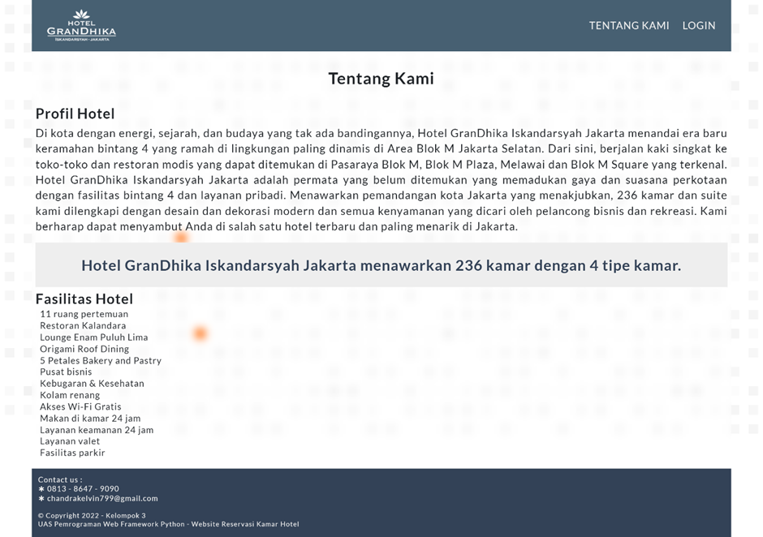

# UAS-PWFP-SewaKamarHotel

- Dibuat untuk kepentingan **Ujian Akhir Semester Pemrograman Web**.
- Dibuat bersama kelompok (Ferry, Kelvin, Kevin)
- Autentikasi & Otorisasi pengguna.
- Mengelolah data Pengguna
- Mengelolah data Kamar
- Mengelolah data Reservasi
- Membuat Laporan Reservasi

Website ini dibuat menggunakan teknologi :
**_HTML, CSS, Bootstrap, Python, Flask, MySQL_**

---

# Tampilan Website

## Halaman Utama

## Halaman Tentang Kami

## Halaman Login

## Halaman Register

## Halaman Beranda

## Halaman Daftar User

## Halaman Kirim Email

## Halaman Daftar Kamar

## Halaman Tambah Kamar

## Halaman Edit Kamar

## Halaman Daftar Reservasi

## Halaman Tambah Reservasi

## Hasil Generate Laporan Reservasi

